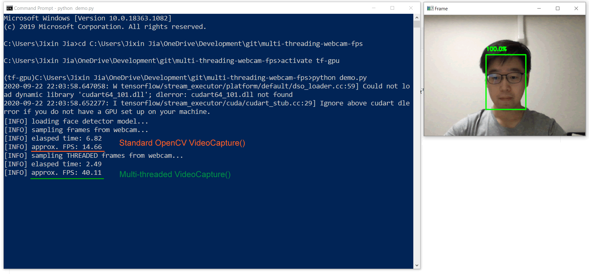

# Multithread Webcam Access in OpenCV
An elegant implementation of multi-threaded webcam access in OpenCV

# Usage
Execute `python demo.py` to check performance improvement before and after applying the multi-threading to OpenCV's videoCapture() stream.      

Expect 300% - 1000% performance boost compared to the standard OpenCV

